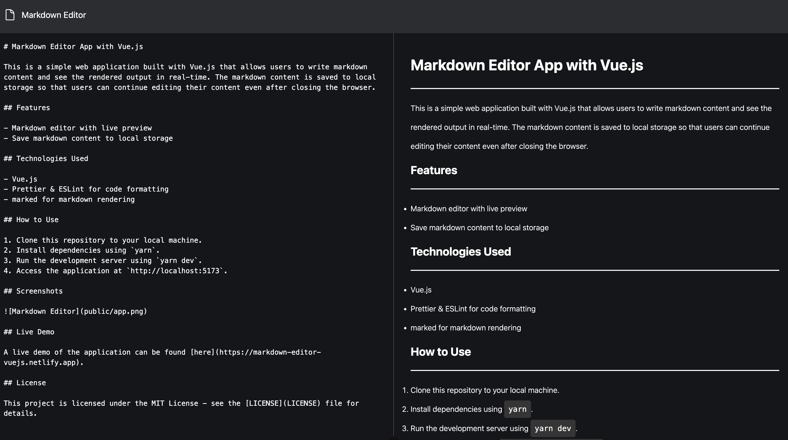

# Markdown Editor App with Vue.js

This is a simple web application built with Vue.js that allows users to write markdown content and see the rendered output in real-time. The markdown content is saved to local storage so that users can continue editing their content even after closing the browser.

## Features

- Markdown editor with live preview
- Save markdown content to local storage 

## Technologies Used

- Vue.js
- Prettier & ESLint for code formatting
- marked for markdown rendering

## How to Use

1. Clone this repository to your local machine.
2. Install dependencies using `yarn`.
3. Run the development server using `yarn dev`.
4. Access the application at `http://localhost:5173`.

## Screenshots

 

## Live Demo

A live demo of the application can be found [here](https://markdown-editor-vuejs.netlify.app).

## License

This project is licensed under the MIT License - see the [LICENSE](LICENSE) file for details.